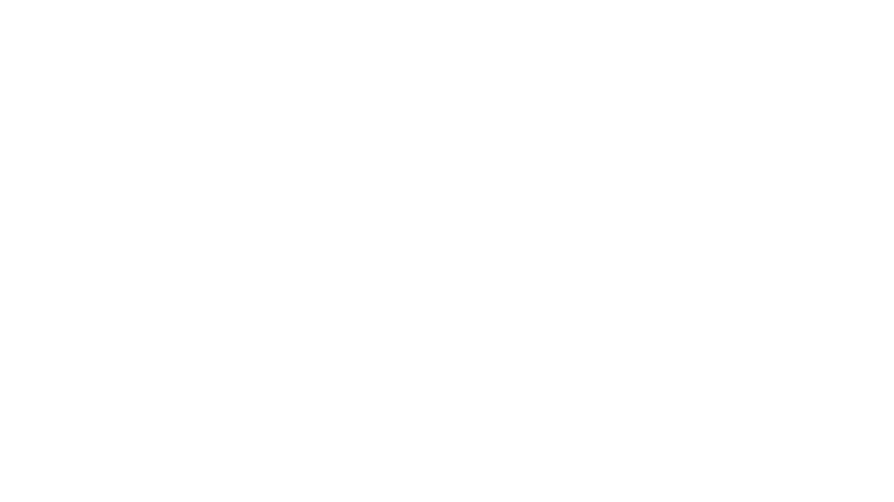

# Chromecast Emulator Demo 🚀

This is an example on how to develop a Chromecast Emulator for your own project!

## Tech Stack
### Frontend:
* [Svelte 5/SvelteKit](https://svelte.dev/)
    * Typescript
    * Prettier
* [Chromecast CAF](https://developers.google.com/cast/docs/overview)
### Backend:
* Nodejs + TSX
* [Websockets](https://github.com/websockets/ws)

## Resources
* [ajhsu - chromecast-device-emulator](https://github.com/ajhsu/chromecast-device-emulator)
  * [Example IPC Messages](https://github.com/ajhsu/chromecast-device-emulator/blob/master/examples/scenarios/BasicReceiverCAF-sample.json)
* [Google Cast - Main Messages](https://developers.google.com/cast/docs/media/messages)
* [Google Cast - Custom Web Receiver](https://developers.google.com/cast/docs/web_receiver/basic)
* [Google Cast - Custom Web Sender](https://developers.google.com/cast/docs/web_sender)
* [Google Cast - CaC Tool](https://casttool.appspot.com/cactool/)
* [UI SVG Set](https://www.svgrepo.com/collection/solar-broken-line-icons)

## How it Works
The HTML Chromecast receiver is a static webpage the is provided to a Google Console where it is registered and assigned an Application ID. Because of this, we can exploit the page slightly, and trick our Chrome browser into allowing a Chromecast receiver page to think it's running on Chromecast hardware.

This is done via the following:
1. A polyfill to provide Chromecast relevant objects to the `window`.
1. A custom Websocket Server that runs on the same port as the Chromecast receiver so that we can communicate between the local sender and local receiver using Chromecast recognized IPC messages.

## How to Setup

You can look at [/wss](./wss/README.md) to find out how to set up the WebSocketServer.

You can run the Websocket server with the following command:
```bash
yarn serve
```

You can run the SvelteKit server with the following command:
```bash
yarn dev
```

## How to Use
Open the web page by navigating to the provided localhost endpoint:
```md
http://localhost:<port>
```
From here, you can navigate to the `Sender` and `Receiver` pages.

1. Open the Receiver page by navigating to:
    ```md
    http://localhost:<port>/receiver
    ```
1. Open the Sender page by navigating to:
    ```md
    http://localhost:<port>/sender
    ```
1. With both pages open, you can now start to use the local sender to send requests to the local receiver! Make sure you have the `wss` running by completing the [How to Setup](#how-to-setup) step above.
1. You can connect to the receiver from the sender page by first pressing "Cast Locally" on the sender, and then "Send Load Request". You can read more about how the sender page works [here](#sender-page).

### Sender Page
The sender page acts as the controller and the load request initiator.

#### Cast Locally
At the top of the page, there is a button called "Cast Locally". This button is used to begin the connection to a local Chromecast receiver page. If you have an opened Chromecast receiver page connected to your Websocket Server, you can press this button to have the receiver page begin a session with your local sender.

If you press this button and the button turns green, you have successfully connected to your receiver page. You'll also see your Chromecast receiver page reach an idle state with the loading spinner at the bottom disappearing.

#### Send Load Request
At the top of the page, there is a button called "Send Load Request". You can press the reel icon to send the load request to the Chromecast receiver page.

The load request itself is built below, and as a default will provide Big Buck Bunny content that you can play around with its values, such as title and subtitle or image.

You can also provide a custom load request if you have one in mind. You'll need to source your own for now.

#### Mini Controller
Acting as a mini-controller, the center of the page features a few common video controls, like a seek bar, play/pause controls, volume controls and a poster image plut title/subtitle display while content is playing.

Controls | &nbsp;
-- | -- |
**Metadata** | Includes the title/subtitle and poster image that can appear during content playback.
**Seek Bar** | Includes the seeking bar, the current duration and the total duration of the content.
**Basic Controls** | Includes the play/pause, FF/RW controls.
**Volume Controls** | Includes the mute/unmute toggle and the volume slider.


### Receiver Page
It's just a demo receiver page 😊


## Using a Custom Receiver
The likeliness is you will want to be able to utilize the local sender page with a current Chromecast receiver solution. Good news is it should work great with any solution so long as the following changes to a receiver can be achieved for local development testing.

### Basic Implementation
With no changes, the local sender page will already work with your receiver! 😃

> Don't forget to supply your own custom `Load Request`! 

The basic implementation will not have the Chromecast UI overlaying the receiver, and it will not have seek bar synchronization. Keep reading to find out how to implement those!

### Adding UI
To add the UI overlay to your Chromecast receiver page when running locally, you'll need to be able to add in an additional script to your receiver.

This script must be available **BEFORE** the Chromecast receiver script. You can try adding a `defer` to the Chromecast receiver script, if possible.

#### Example Setup
```html
<!-- Polyfill and framework need to be loaded in sync, local setup, and Receiver setup need duplication -->
<script src="/platform-polyfill.js"></script>
<script defer src="//www.gstatic.com/cast/sdk/libs/caf_receiver/v3/cast_receiver_framework.js"></script>
```

Once complete, the UI should load successfully! There is limited keyboard support with this UI in the case that you don't have the local sender page open:
1. Arrow keys will seek 10 secs forward/backward.
1. Enter key will play/pause toggle.


### Adding Seek Synchronization
The Websocket Server is capable of handling seeking synchronization by having the receiver broadcast updates to the Websocket more often. The following code can be provided in the receiver once the `PlayerManager` is available.

```ts
const castContext = cast.framework.CastReceiverContext.getInstance()
castContext
    .getPlayerManager()
    .addEventListener(cast.framework.events.EventType.TIME_UPDATE, (_) => {
        castContext.getPlayerManager().broadcastStatus(true)
    })
```

### Last Steps
Make sure you have a way to disable any of the above custom work when you are testing a physical Chromecast device or it may cause unintended problems.


<center>

</center>

## Troubleshooting
### Video metadata provided to the mini-controller, but video is not playing on the receiver
This can happen when the receiver page does not have focus at the time of the video load. It will not be able to autoplay content if this happens.
* You can first try to play the content by pressing the play button on the mini-controller.
* Or you may need to open the Chrome devtools on the receiver page and type in the following console command:
    `cast.framework.CastReceiverContext.getInstance().getPlayerManager().play()`

### Physical Chromecast device not working after testing locally
Make sure you terminate the Websocket service when you are testing a physical device just in case it is somewhow messing with your actual Chromecast Websocket messages.

Also make sure you don't have any lingering custom code that you may have set up in the [above steps](#last-steps).